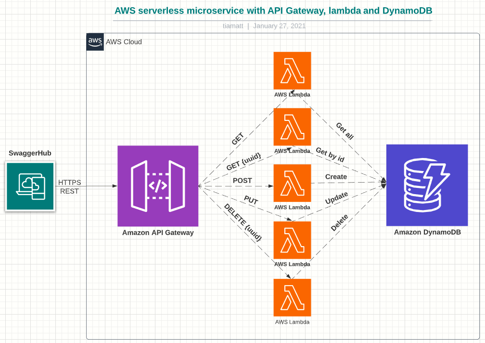

# AWS Serverless Microservice With Lambda Application

This project is a simple serverless microservice on AWS that enables users to create and manage movies data. The entire backend is based on API Gateway, Lambda and DynamoDB.

## **Overview**

The goal of this project is to show how to create an application composed of small, easily deployable, loosely coupled, independently scalable, serverless components.

As I’m strongly against managing environments manually and take **Infrastructure as Code** :blue_heart: for granted, AWS SAM will be a great fit for this serverless project. As a result, the entire application should be deployed in any AWS account with a single CloudFormation template.

## **Architecture**

:one: A user sends a request to the server by calling APIs from SwaggerHub UI. The request which includes all necessary information is sent to Amazon API Gateway restful service.

:two: API Gateway transfers the collected user information to a Lambda function.

:three: AWS Lambda function executes event-based logic calling DynamoDB database.

:four: DynamoDB provides a persistence layer where data can be stored/retrieved by the API's Lambda function.

The high-level architecture for the serverless microservice is illustrated in the diagram below:




## **Initial Setup**

To codify, build, package, deploy, and manage our AWS resources in a fully automated fashion, use the following:

:point_right: AWS SAM

:point_right: AWS Cloud​Formation

:point_right: AWS CLI

:point_right: AWS SDK for Python (boto3)

:point_right: Docker

## **AWS Resources**

Here is the list of AWS resources that the project template creates:

:heavy_check_mark: AWS Lambda

:heavy_check_mark: Amazon DynamoDB

:heavy_check_mark: Amazon API Gateway

:heavy_check_mark: AWS IAM

:heavy_check_mark: Amazon S3 (that is where your CloudFormation template will be stored)

Lambda functions are written on Python 3.8.

## **Download the project**

To clone the GitHub repository, execute the following command:

## **Build and Deploy**

To build and deploy your application for the first time, run the following in your shell:

```YAML
sam build --use-container
sam deploy --guided
```

## **Cleanup**

To delete the sample application that you created, use the AWS CLI:

```YAML
sam delete
```